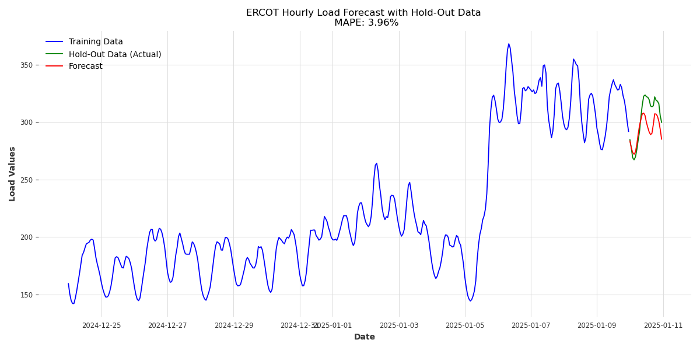

# Using Darts for Time Series Analysis in Python

Darts simplifies time series analysis by providing a unified interface for multiple forecasting methods, from traditional statistical approaches to advanced machine learning models.

Darts is a time series and forecasting library that streamlines building, evaluating, and deploying time series models. It is essentially a wrapper for many models, ranging from ARIMA to LSTM++.

Darts provides a unified API for a variety of time series models, allowing us to switch between models and compare their performance. It also has built-in preprocessing for resampling, scaling, and handling missing data. Additionally, it includes evaluation tools for standard metrics like MAE, MAPE, RMSE, and cross-validation.

Let's try it out. Install Darts with:

pip install darts

# Basic Workflow

The typical workflow in Darts involves creating a TimeSeries object, choosing and training a model, making predictions, and evaluating results.

Darts requires data to be in a TimeSeries object, which wraps around Pandas DataFrames.

In this project, I use data from FRED (Federal Reserve Bank of St. Louis) on the 10-Year Treasury Constant Maturity Minus 2-Year Treasury Constant Maturity (T10Y2Y). The T10Y2Y is a financial indicator that measures the difference between the yields of 10-year and 2-year U.S. Treasury securities (also known as the \"yield spread\" or the \"term spread\") in basis points. A positive spread means that 10-year bonds have higher yields than 2-year bonds, which is the normal situation. A negative spread (also known as a yield curve inversion) is a sign of potential economic slowdown or recession. Economists and investors use this as an indicator of market expectations about future economic conditions and monetary policy.

FRED provides this data via an API. You can request an API key for free and update the code with it.

# Traditional Methods in Darts

Darts supports traditional methods like Exponential Smoothing and ARIMA for quick, interpretable forecasts.

## Exponential Smoothing

I included way too much history in this version. The forecast is just 10 steps, so it appears as a small blue dot at the end that you can barely see.

## ARIMA

The autoARIMA implementations in other tools like statsmodels are easier to use than Darts. But let's still look at it.

In this visualization, I zoomed in so that the prediction---essentially a straight line for the next 30 days---becomes much easier to see.

# Machine Learning Models in Darts

But that is just the start. Darts can also do more advanced forecasting with machine learning models like Random Forests and LightGBM. I have another article that goes deeper into N-BEATS.

## N-BEATS for Time Series Forecasting in Python

N-BEATS (Neural Basis Expansion Analysis for Time Series) is a deep learning model specifically designed for time series forecasting.

# Evaluating Models

Darts makes it easy to evaluate model performance using metrics like MAE, RMSE, and MAPE.

## Real World Example: Energy Load Data

I pulled data for energy load in ERCOT for every 15 minutes from December 24, 2024, to January 11, 2025. Then, I repeated these steps using the new dataset.

import pandas as pd import matplotlib.pyplot as plt from darts import TimeSeries from darts.models import ExponentialSmoothing from darts.metrics import mape

    # Load the ERCOT data
df = pd.read_csv("ercot_load_data.csv") df['date'] = pd.to_datetime(df['date']) # Ensure 'date' is in datetime format df['values'] = pd.to_numeric(df['values'], errors='coerce') # Convert 'values' to numeric df = df.sort_values('date') # Sort by date

    # Drop rows with missing or NaN values
df = df.dropna()

    # Resample the data to hourly frequency
df = df.set_index('date').resample('h').mean().reset_index() # Resample and take the mean for each hour

    # Define hold-out period
hold_out_hours = 24 # 24 hours = 1 day train = df.iloc[:-hold_out_hours] hold_out = df.iloc[-hold_out_hours:]

    # Create TimeSeries for training and hold-out data
series_train = TimeSeries.from_dataframe(train, 'date', 'values', freq="h", fill_missing_dates=True) series_hold_out = TimeSeries.from_dataframe(hold_out, 'date', 'values', freq="h")

    # Fit the Exponential Smoothing model on training data
model = ExponentialSmoothing() model.fit(series_train)

    # Forecast the hold-out period
forecast = model.predict(len(series_hold_out))

    # Calculate MAPE
mape = mape(series_hold_out, forecast)

    # Plot the results
plt.figure(figsize=(12, 6))

    # Plot training data
series_train.plot(label="Training Data", color='blue')

    # Plot hold-out data
series_hold_out.plot(label="Hold-Out Data (Actual)", color='green')

    # Plot forecasted data
forecast.plot(label="Forecast", color='red')

plt.title(f"ERCOT Hourly Load Forecast with Hold-Out Data \n MAPE: {mape:.2f}%") plt.xlabel("Date") plt.ylabel("Load Values") plt.legend() plt.grid(True) plt.tight_layout() plt.savefig("ERCOT_Hourly_HoldOut_Forecast.png") plt.show()

The exponential smoothing works better than ARIMA on this dataset.

import pandas as pd import matplotlib.pyplot as plt from darts import TimeSeries from darts.models import ARIMA

    # Define hold-out period
hold_out_hours = 24 # Example: 24 hours = 1 day train = df.iloc[:-hold_out_hours] hold_out = df.iloc[-hold_out_hours:]

    # Create TimeSeries for training and hold-out data
series_train = TimeSeries.from_dataframe(train, 'date', 'values', freq="h", fill_missing_dates=True) series_hold_out = TimeSeries.from_dataframe(hold_out, 'date', 'values', freq="h")

    # Fit the ARIMA model
model = ARIMA(p=1, d=1, q=1) # You can adjust p, d, q parameters model.fit(series_train)

    # Forecast the hold-out period
forecast = model.predict(len(series_hold_out))
    # Calculate MAPE
mape_result = mape(series_hold_out, forecast)

    # Plot the results
plt.figure(figsize=(12, 6))

series_train.plot(label="Training Data", color='blue') series_hold_out.plot(label="Hold-Out Data (Actual)", color='green') forecast.plot(label="Forecast", color='red')

plt.title(f"ERCOT Hourly Load Forecast with ARIMA and Hold-Out Period \n MAPE: {mape_result:.2f}%") plt.xlabel("Date") plt.ylabel("Load Values") plt.legend() plt.grid(True) plt.tight_layout() plt.savefig("ARIMA_Hourly_HoldOut_Forecast.png") plt.show()

But wait, there's more! Darts has tools for Backtesting to evaluate how well a model performs over historical data. It can perform Transformations like scaling, log-transforming, or normalizing data before modeling. And it supports Ensembling to combine multiple models for better forecasts.

# Deployment with Darts

You can pickle Darts models so they are easy to containerize for inference.

Darts is a powerful time series and forecasting library with an intuitive API and a lot of options. It covers most of the tools you need for day-to-day time series work.

# Predicting Sunspots with ARIMA, Theta, and TBATS in DARTS with Python

Sunspot observations are one of science's longest continuous datasets and a good case study for time series analysis. Let's explore how modern forecasting techniques can help predict future solar activity. The sunspot dataset, maintained by the WDC-SILSO, Royal Observatory of Belgium, Brussels, contains monthly observations since 1749.

This is an earlier version of the project. I was experimenting with smoothing options. In our analysis, we transform this monthly data into yearly averages to better observe the Sun's long-term patterns, particularly the roughly 11-year solar cycle first discovered by Heinrich Schwabe in 1843. This dataset has been extensively studied by researchers worldwide, from Daines Analytics' SARIMA modeling to Python's Gurus' work with the Darts library. Our analysis builds upon this foundation.

## Our Analysis

Our analysis implements multiple forecasting models:

import pandas as pd import numpy as np import matplotlib.pyplot as plt from darts import TimeSeries from darts.models import ARIMA, Theta, TBATS from darts.metrics import mape, rmse from darts.utils.utils import SeasonalityMode import warnings

warnings.filterwarnings('ignore')

## TimeSeriesAnalyzer Class

The following class is used to load the data, train models, and evaluate their performance:

class TimeSeriesAnalyzer: def __init__(self): self.models = { 'ARIMA': ARIMA(p=2, d=1, q=2, seasonal_order=(1, 1, 1, 11)), 'Theta': Theta(season_mode=SeasonalityMode.ADDITIVE, seasonality_period=11), 'TBATS': TBATS(use_trend=True, use_box_cox=False, seasonal_periods=[11]) }

def _load_csv_data(self, filepath): """Load and prepare sunspot data.""" try:
                # Read the CSV file with the new format
df = pd.read_csv(filepath)

                # Split the Month column into Year and Month
df[['Year', 'Month']] = df['Month'].str.split('-', expand=True)

                # Convert to proper datetime
df['Date'] = pd.to_datetime(df['Year'] + '-' + df['Month'] + '-01')

                # Replace 0 values with 1 to avoid log transform issues
df['Sunspot'] = np.where(df['Sunspot'] == 0, 1, df['Sunspot'])

                # Convert to yearly averages
df_yearly = df.groupby(df['Date'].dt.year)['Sunspot'].mean().reset_index() df_yearly['Date'] = pd.to_datetime(df_yearly['Date'].astype(str) + '-01-01')

                # Create TimeSeries object
series = TimeSeries.from_dataframe(df_yearly, 'Date', 'Sunspot')

return series

except Exception as e: print(f"Error loading data: {str(e)}") return None

def load_data(self, filepath=None): return self._load_csv_data(filepath)

def analyze(self, series, train_test_split=0.8): """Train models and evaluate predictions""" if series is None: print("No data to analyze") return None, None, None

train_size = int(len(series) * train_test_split) train = series[:train_size] test = series[train_size:]

results = {} for name, model in self.models.items(): print(f"\nTraining {name}...") try: model.fit(train) pred = model.predict(len(test)) metrics = self._calculate_metrics(test, pred) results[name] = {'prediction': pred, **metrics} self._print_metrics(name, metrics) except Exception as e: print(f"Error training {name}: {str(e)}") continue

return results, train, test

def _calculate_metrics(self, actual, predicted): try: return { 'MAPE': mape(actual, predicted), 'RMSE': rmse(actual, predicted), } except Exception as e: print(f"Error calculating metrics: {str(e)}") return {'MAPE': np.nan, 'RMSE': np.nan}

def _print_metrics(self, model_name, metrics): print(f"{model_name} Performance:") for metric, value in metrics.items(): if not np.isnan(value): print(f"{metric}: {value:.2f}")

def plot_results(self, series, results, train, test, save_path='forecast.png'): """Plot predictions from all models""" if series is None or results is None: print("No data to plot") return

plt.figure(figsize=(15, 7)) train.plot(label='Training', alpha=0.6) test.plot(label='Test', alpha=0.6)

if results: colors = plt.cm.rainbow(np.linspace(0, 1, len(results))) for (name, result), color in zip(results.items(), colors): if 'prediction' in result: result['prediction'].plot( label=f'{name} (MAPE: {result["MAPE"]:.1f}%)', color=color )

plt.title('Sunspot Number Forecasting Comparison') plt.xlabel('Time') plt.ylabel('Sunspot Number') plt.legend(bbox_to_anchor=(1.05, 1), loc='upper left') plt.grid(True, alpha=0.3) plt.tight_layout() plt.savefig(save_path, bbox_inches='tight') plt.close()

## Main Function

The main function loads the data, performs the analysis, and plots the results:

def main(): analyzer = TimeSeriesAnalyzer()

real_series = analyzer.load_data("SN_m_tot_V2.0.csv") real_results, real_train, real_test = analyzer.analyze(real_series) analyzer.plot_results(real_series, real_results, real_train, real_test, 'sunspot_forecast.png')

if __name__ == "__main__": main()

This real-world example demonstrates both the power and limitations of time series forecasting. While we can capture major patterns, solar activity's inherent complexity means predictions should be used as guidance rather than absolute forecasts.

# N-BEATS for Time Series Forecasting in Python

N-BEATS (Neural Basis Expansion Analysis for Time Series) is a deep learning model specifically designed for time series forecasting. It provides a flexible framework for univariate and multivariate forecasting tasks. N-BEATS works without requiring explicit feature engineering, making it more like an autoML tool compared to other deep learning frameworks.

N-BEATS can capture patterns in time series data without needing prior training. This makes it a good choice for datasets where the underlying dynamics are not known or are too complicated for simpler models to grasp (looking at you, ARIMA).

N-BEATS is also a general-purpose model. It autonomously decomposes time series into components, such as trend and seasonality, without requiring explicit specification from the user. Essentially, it handles the hard work of feature engineering.

It is recursive, which is unique, and allows it to generate predictions over extended time horizons. N-BEATS stacks multiple fully connected layers organized into blocks. Each block learns a specific pattern (e.g., trend or seasonality). The process works as follows:

- Backward Pass: Learns past components of the time series.

- Forward Pass: Projects future components for forecasting.

- Residuals: Adjusts for any remaining unexplained variance.

Let's try it.

There are several ways to call an N-BEATS model. I prefer using the Darts library because it simplifies implementation, and I appreciate the backtesting features within Darts. Backtesting can be used to evaluate model performance over historical data.

## Installation

Ensure you have Darts installed:

pip install darts

## Univariate Forecasting and Backtesting with N-BEATS

Backtest Results:

- MAPE: 10.35%

- RMSE: 6.34

- MAE: 5.69

## Multivariate Forecasting with N-BEATS

N-BEATS can handle multiple variables to improve predictions for complex datasets.

Backtest Results:

- MAPE: 10.35%

- RMSE: 6.34

- MAE: 5.69

## Key Benefits of N-BEATS

N-BEATS offers a trifecta of advantages for time series forecasting:

- Flexible: Can be used with a range of data types without requiring extensive customization.

- Versatile: Can be applied to various domains such as financial markets, weather patterns, and more.

- Accurate: Provides reliable and precise predictions.

Bonus: N-BEATS is surprisingly user-friendly.

## Key Takeaways

- Backward Pass: Learns past components of the time series.
- Forward Pass: Projects future components for forecasting.
- Residuals: Adjusts for any remaining unexplained variance.
- MAPE: 10.35%
